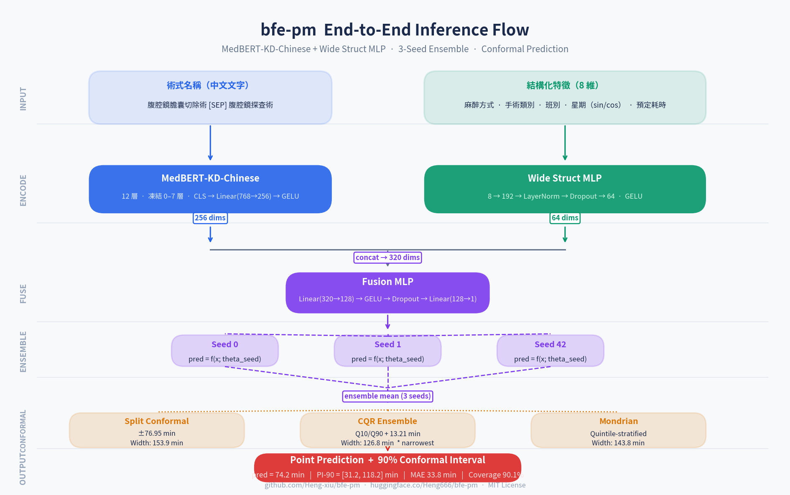

# bfe-pm: Surgical Duration Prediction with Conformal Intervals



**bfe-pm** (*BERT Fusion Ensemble — Procedure Matched*) is a dual-stream neural network for surgical duration prediction, combining MedBERT-KD-Chinese text encoding with structured scheduling features. It provides point predictions and calibrated 90% prediction intervals via conformal prediction.

> **Paper**: *Conformalized Uncertainty Quantification for Surgical Duration Prediction: From Marginal Intervals to Subgroup Exchangeability Failure*
> IEEE Journal of Biomedical and Health Informatics (JBHI) format

---

## Results

| Model | MAE (min) | 90% Interval Width | Coverage |
|-------|-----------|-------------------|----------|
| Scheduled Duration (baseline) | 58.0 | 290.0 min | 90.2% |
| XGBoost | 38.8 | 176.0 min | 89.4% |
| LightGBM | 37.1 | 178.0 min | 89.4% |
| **bfe-pm (this repo)** | **33.8** | **126.8 min** | **90.1%** |

Evaluated on ~50k de-identified surgical records from a de-identified institutional dataset (stratified 70/15/15 split).

---

## Quickstart

### Installation

```bash
git clone https://github.com/Heng-xiu/bfe-pm.git
cd bfe-pm
pip install -r requirements.txt
```

### Download Model Checkpoints

Checkpoints are hosted on HuggingFace Hub:

```python
from huggingface_hub import snapshot_download
snapshot_download("Heng666/bfe-pm", local_dir="checkpoints/")
```

Or download individual seeds:

```bash
huggingface-cli download Heng666/bfe-pm bfe_pm_seed0_best.pt --local-dir checkpoints/
huggingface-cli download Heng666/bfe-pm bfe_pm_seed1_best.pt --local-dir checkpoints/
huggingface-cli download Heng666/bfe-pm bfe_pm_seed42_best.pt --local-dir checkpoints/
```

### Python Inference

```python
from bfe_pm import BfePmPredictor

predictor = BfePmPredictor(local_checkpoint_dir="checkpoints/")

result = predictor.predict(
    operation_text="腹腔鏡膽囊切除術",
    scheduled_duration=90,     # surgeon's estimate in minutes
    anesthesia="GA",
    surgery_type="常規刀",
    shift="白班",
    weekday_str="星期二",       # recommended: Chinese string, avoids int mapping ambiguity
)

print(result)
# {
#   'point_pred_min': 74.2,
#   'interval_90': [52.6, 121.8],
#   'interval_method': 'split_conformal',
#   'interval_coverage_target': 0.90,
#   'model_name': 'bfe_pm_ensemble_v1'
# }
```

### Gradio Demo

```bash
python demo/app.py --checkpoint_dir checkpoints/
# Opens at http://localhost:7860
```

### REST API (LitServe)

```bash
pip install litserve
python api/server.py --checkpoint_dir checkpoints/ --port 8080
```

```bash
curl -X POST http://localhost:8080/predict \
  -H "Content-Type: application/json" \
  -d '{
    "operation_text": "腹腔鏡膽囊切除術",
    "scheduled_duration": 90,
    "anesthesia": "GA",
    "surgery_type": "常規刀",
    "shift": "白班",
    "weekday_str": "星期二"
  }'
```

---

## Model Architecture

```
Input: procedure name (Chinese text) + 8 structured features
         │                                      │
         ▼                                      ▼
  MedBERT-KD-Chinese              Wide Struct MLP
  (freeze layers 0–7)             192 → LayerNorm → 64
  CLS token → Linear(768, 256)          GELU
         │                                      │
         └──────────── concat(256+64) ──────────┘
                              │
                    Linear(320, 128) → GELU
                    Linear(128, 1)
                              │
                    ┌─────────┴─────────┐
               Point prediction    ×3 seeds → ensemble
```

**Structured features (8 dims):**
- Scheduled duration (normalized)
- Anesthesia type (soft-encoded index)
- Surgery category (soft-encoded index)
- OR shift (soft-encoded index)
- Weekday (sin/cos encoding)
- Daytime surgery flag
- Outpatient surgery flag

**Conformal prediction** (90% coverage):
- Split conformal: symmetric interval ±76.95 min around point prediction
- CQR ensemble: asymmetric intervals from quantile head (±13.21 min correction)

---

## Training from Scratch

### 1. Prepare data

```bash
python scripts/prep_data.py \
  --input surgical_records.xls \
  --output data/processed.parquet
```

### 2. Train bfe-pm (3 seeds)

```bash
for seed in 0 1 42; do
  python train/train_bfe_pm.py \
    --data data/processed.parquet \
    --seed $seed \
    --out_dir checkpoints/ \
    --epochs 30
done
```

Approximate training time: ~2 hours per seed on RTX 3090.

### 3. Reproduce conformal results

```python
from bfe_pm import BfePmPredictor
from bfe_pm.conformal import conformal_threshold
import numpy as np

predictor = BfePmPredictor(local_checkpoint_dir="checkpoints/")
# ... load calibration set, compute nonconformity scores, get q_hat
```

---

## Input Specification

| Field | Type | Values | Notes |
|-------|------|--------|-------|
| `operation_text` | str | Chinese procedure names | Multiple joined with ` [SEP] ` |
| `scheduled_duration` | float | Minutes | 0 = unknown |
| `anesthesia` | str | GA \| EPI \| SA \| MAC \| Local \| Block \| IV | |
| `surgery_type` | str | 常規刀 \| 急診刀_Urgent \| 急刀_Emergency \| 日間手術 \| 門診手術 | `is_daytime`/`is_outpatient` auto-derived from this field |
| `shift` | str | 白班 \| 小夜 \| 大夜 | |
| `weekday_str` | str | 星期一 … 星期天 | **Recommended**; maps Monday=0 … Sunday=6 matching training |
| `weekday` | int | 0=Monday … 6=Sunday | Fallback if `weekday_str` not provided; follows pandas `dayofweek` |

---

## Conformal Prediction Notes

- **Coverage guarantee applies to elective cases (常規刀) only.** Emergency and urgent cases exhibit residual distribution shift between calibration and deployment sets (Mann-Whitney p < 10⁻⁹), reducing actual coverage to ~80% for emergency cases.
- Pre-computed thresholds in `checkpoints/conformal_thresholds.json` are from a held-out calibration split. For deployment, re-calibrate on a held-out set from your institution.
- Temporal validation with a recent chronological calibration window: all three conformal methods retain valid coverage. CQR: 89.3% at 125.8 min.

---

## Citation

If you use this code or model in your research, please cite the software repository:

```bibtex
@software{bfe_pm_2025,
  title        = {bfe-pm: Surgical Duration Prediction with Conformal Intervals},
  author       = {Heng-xiu},
  year         = {2025},
  publisher    = {GitHub},
  url          = {https://github.com/Heng-xiu/bfe-pm},
  note         = {Dual-stream MedBERT-KD-Chinese + wide struct MLP with conformal prediction}
}
```

A `CITATION.cff` file is included in the repository root for GitHub's native "Cite this repository" support.

---

## License

**Code** (this repository): [MIT License](LICENSE)

**Model weights**: Not publicly released. The trained checkpoints are held privately. If you are interested in using the model for non-commercial research purposes, please open a [GitHub Issue](https://github.com/Heng-xiu/bfe-pm/issues) describing your use case.
